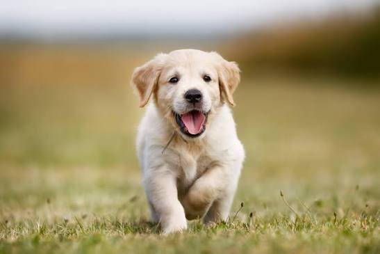
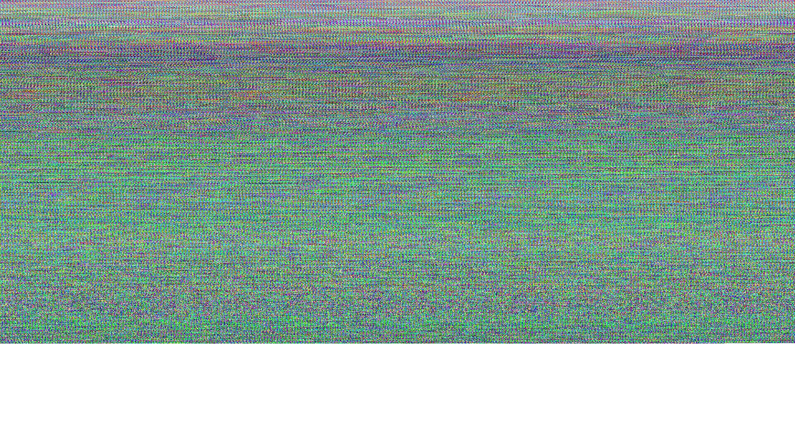
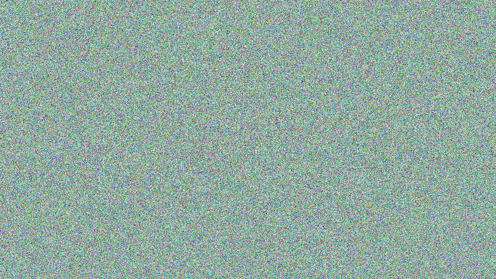

## LShhB | 🤫
```
LShhB <MODE> <ACTION> <DATA_TYPE> <SOURCE(_PATH)> <IMAGE_PATH> <optional:OUTPUT_PATH>

Shh..

MODE:
1) simple - simple hiding algorithm.
2) advanced - seed-based hiding algorithm. Password required.

ACTION:
1) help (--help, -h) - print help informaton.
2) hide - hide information (string, any file, image) in image.
3) read - read hiden information in image.

DATA_TYPE:
Uses with ACTION=hide/read.
1) str - hide/read input string.
2) file - hide/read file.
3) image - hide/read image.

SOURCE(_PATH):
Uses with ACTION=hide.
String or path to file/image you want to hide.

IMAGE_PATH:
Uses with ACTION=hide/read.
Image will be loaded in memory and saved as new image with hidden information.
New image will be saved as 'image_with_secret.png' where you run app from, if you does not use OUTPUT_PATH.
Supports ONLY .png.

OUTPUT_PATH:
Uses with ACTION=hide/read.
Result of action will be saved in this path.
Filename must not include extension if ACTION=read & DATA_TYPE=image.

For example:
./LShhB advanced hide str "This message will be hidden in container image with path = ~/Pictures/container.png as ~/mySecret.png" ~/Pictures/container.png ~/mySecret.png
./LShhB simple hide image ~/Pictures/source.jpeg ~/Pictures/container.png
./LShhB simple read image ~/image_with_secret.png ~/myDirectory/secret_from_image
```

# Example
I have the `dog.jpg` with size `547x365`:  


I want to hide it in image `container.png` - white picture with size `1920x1080`:  
  

I'm sure dog will be full fitted into container, because number of dog bits = 547 * 365 * 3 * 8 = 4'791'720 
and number of container bytes, where I can hide dog bits (RGB) = 1920 * 1080 * 3 = 6'220'800 (1 container byte can contains 1 bit information).

But also I should hide in image signature (to understand that image has secret message) 
and header (to know information about hidden information). So, it will be 7 * 8 + 33 = 89 bits of help data, 
and container definetely can contains the dog.

Let's hide dog in container:  
`./LShhB simple hide image ./assets/dog.jpg ./assets/container.png ./assets/container_with_dog.png`.

We can see how change the copy of `container.png`, using 'stretch contrast':


Now we can read hidden dog, using:  
`./LShhB simple read image ./assets/container_with_dog.png hidden_dog`

# Advanced mode

Advanced mode uses a seed to save information in random container pixels:
```
./LShhB advanced hide ./assets/dog.jpg ./assets/contaiener.png ./assets/container_with_advanced_dog.png
Enter password (seed): 
```

If you enter too slow seed (below 8), you will see error:  
```
Enter password (seed): 
ERROR::VALIDATION: Password cannot be < 8
```

`container_with_advanced_dog.png` with stretched contrast looks kinda that:


# Other

1) If `OUTPUT_PATH` is empty:
    - image with hidden information will be saved as `image_with_secret.png`;
    - readen information from image will be saved as `secret_from_image` (+ `.png`/`.jpg` if image was be hidden).
2) If image-container cannot contain full source data, will be saved only part of data that can be saved in image:
```
ONLY 44.0995% of source WILL BE saved due target image capacity.
Do you want to continue? [y/N] 
```